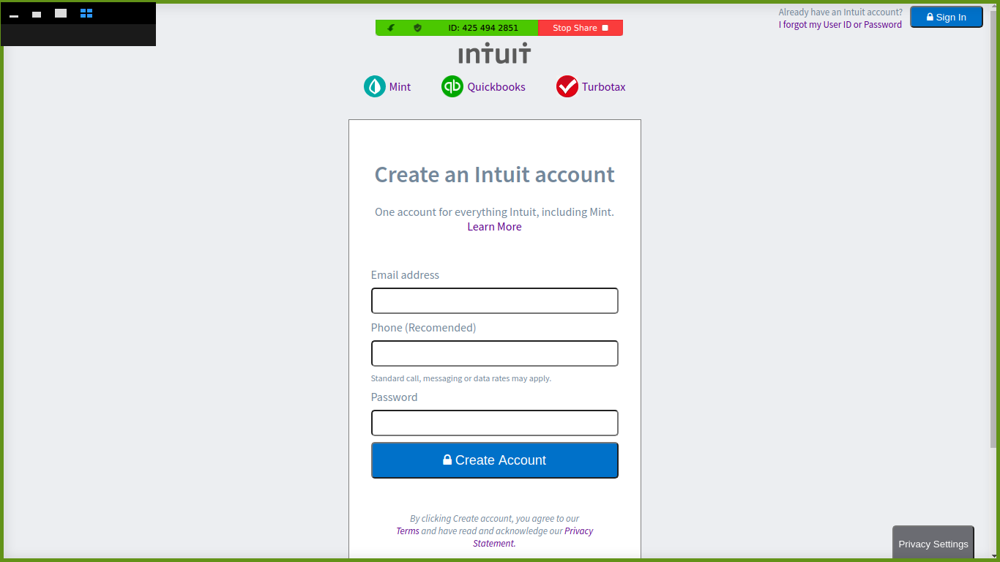

# HTML Forms project Microverse

> We are Microverse students doing some basic HTML and CSS project. We created a basic HTML Structure based on the sign up form for the mint page.

We created a header where there are some information on how to Sign In on the site. We divided the main section in three containers. The first one has the Intuit Company logos for mint, quickbooks and turbotax. The second one contains the main form to fill in the informations to create the account. Finally the third one has the reCaptcha message from Google. The footer section was built with a Privacy Button with a fixed position at the lower right page and some information about copyrights.

## Built With

- HTML
- CSS

## Live Demo

- https://rawcdn.githack.com/julian3493/Microverse-HTML-Forms-Project/e769a6e389660c3b917892fdbbf5e4360fdbc476/signup.html

## Getting Started

To get a local copy up and running follow these simple example steps.

Clone the project repository by typing the command below

- git clone https://github.com/julian3493/Microverse-HTML-Forms-Project.git

After that enter on the directory of the cloned repository
- cd Microverse-HTML-Forms-Project

To see how it looks like open the signup.html file on your browser

## Authors

👤 **Julián**

- GitHub: [@julian3493](https://github.com/julian3493)
- Twitter: [@JulianR16893833](https://twitter.com/JulianR16893833)
- LinkedIn: [LinkedIn](https://www.linkedin.com/in/juli%C3%A1n-ricardo-ramos-arevalo-3868ba135/)

👤 **Marcelo**

- GitHub: [@marcelomaidden](https://github.com/marcelomaidden)
- Twitter: [@marcelomaidden](https://twitter.com/marcelomaidden)
- LinkedIn: [LinkedIn](https://www.linkedin.com/in/marcelo-fernandes-de-ara%C3%BAjo-56700a171/)

## 🤝 Contributing

Contributions, issues, and feature requests are welcome!

Feel free to check the [issues page](issues/).

## Show your support

Give a ⭐️ if you like this project!

## Acknowledgments

We thank all the sites below where we have found lots of meaningful content

- Intuit companies
- W3Schools

## 📝 License

This project is [MIT](lic.url) licensed.
